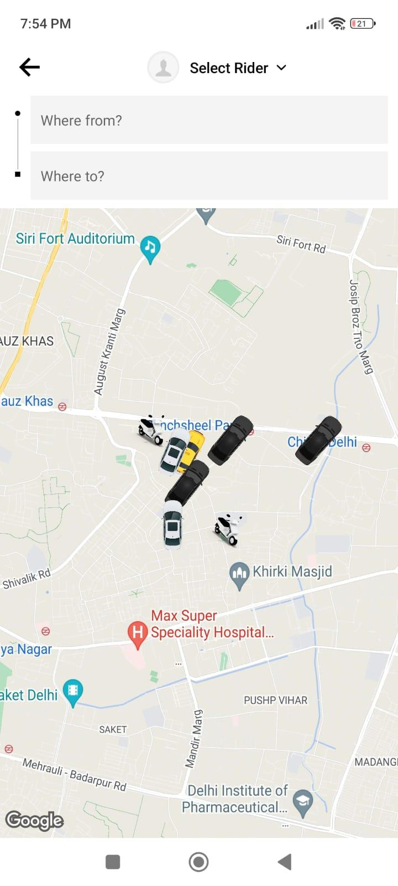
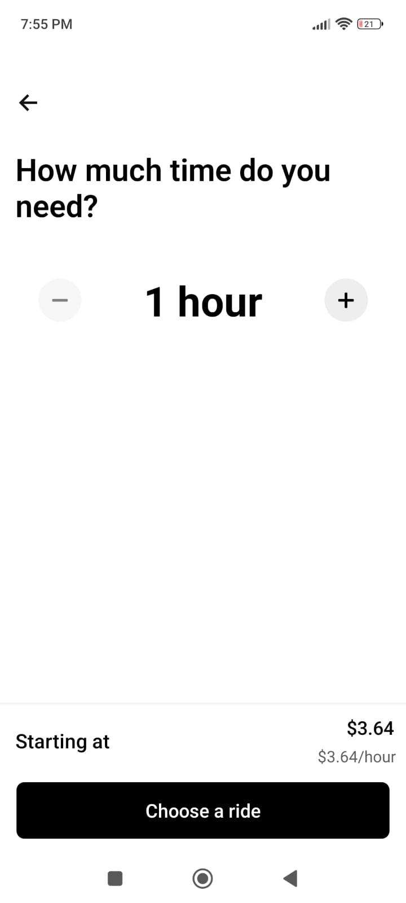
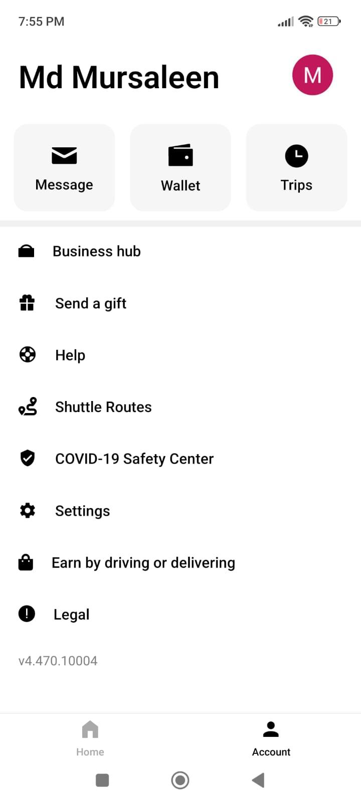

# Ride Booking App

Ride Booking App is a cross-platform mobile application designed to provide users with an easy and affordable way to book rides. Built using React Native, Redux, JavaScript, and Firebase, this full-stack application works seamlessly on both Android and iOS devices.

## Key Features

- **Cross-Platform Compatibility**: Runs on both Android and iOS.
- **User Authentication**: Secure login and registration.
- **State Management**: Efficient state management with Redux.
- **Firebase Integration**: Real-time database and authentication with Firebase.

## Screenshots









## Installation

1. **Clone the repository**:
   ```bash
   git clone https://github.com/Md-Mursaleen/Ride-Booking-App.git
   
2. **Navigate to the project directory**:
   ```bash
   cd Ride-Booking-App
   
3. **Install dependencies**:
   ```bash
   npm install
   
4. **Set up Firebase**:
   Create a new Firebase project.
   Add your Firebase configuration to firebaseConfig.js.

5. **Start the application**:
   ```bash
   npm start

## Usage

1. **Sign Up / Login**: Create an account or log in.
2. **Book a Ride**: Enter pickup and drop-off locations.
3. **Track Your Ride**: Follow your ride in real-time.
4. **Manage Profile**: Update profile information and view ride history.

## Contributing

Contributions are welcome! Follow these steps:

1. Fork the repository.
2. Create a new branch:
   ```bash
   git checkout -b feature-branch
3. Make changes and commit them:
   ```bash
   git commit -m 'Add feature'
4. Push to the branch:
   ```bash
   git push origin feature-branch
5. Open a Pull Request.   
